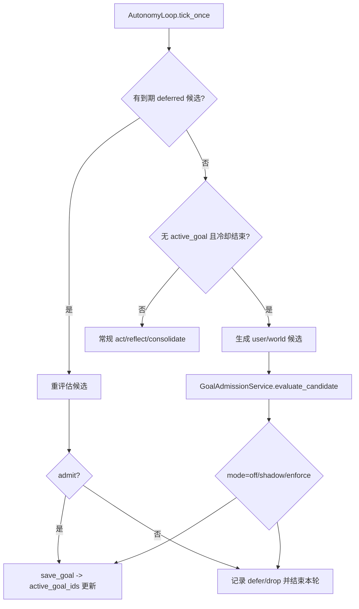

# 目标生成流程说明（当前实现）

本文描述当前后端“目标如何被生成并进入目标看板”的完整链路，覆盖：

- 触发源（`user_topic` / `world_event` / `chain_next`）
- 准入评估（打分、WIP、模式）
- 延迟队列（defer）与重试
- 对外观测接口

---

## 1. 总体链路



---

## 2. 触发源与入口

目标候选来自 3 条路径：

1. `user_topic`：无 active goal 时，最新用户消息可触发候选。  
入口：`AutonomyLoop._try_create_user_topic_goal`

2. `world_event`：无 active goal 且无新用户触发时，最近世界事件可触发候选。  
入口：`AutonomyLoop._try_create_world_event_goal`

3. `chain_next`：当前 active 目标被标记为 `completed` 后，链路续代候选。  
入口：`AutonomyLoop._sync_goal_focus` 的 completed 分支

所有入口都会先调用 `GoalAdmissionService.evaluate_candidate(...)`，只有通过时才 `save_goal(...)`。

---

## 3. 准入评估规则

### 3.1 候选规范化

- `canonical_topic` 会去掉模板前缀（如“继续推进：”“持续理解用户最近在意的话题：”）。
- 基于 `source_type + canonical_topic + chain 信息` 生成 fingerprint，用于去重与幂等。

### 3.2 打分与决策

- `user_topic` / `world_event`：
  - `score = 0.5*actionability + 0.3*persistence + 0.2*novelty`
- `chain_next`：
  - 走独立规则（不使用 novelty），重点考虑 actionability + generation momentum

决策阈值：

- `score >= min_score` -> `admit`
- `defer_score <= score < min_score` -> `defer`
- `score < defer_score` -> `drop`

### 3.3 WIP 限制

- 若推荐结果为 `admit`，但 `active_goals >= wip_limit`，会转成 `defer(reason=wip_full)`。
- 仅约束自治创建链路，不影响手动状态接口的语义。

---

## 4. 模式（off / shadow / enforce）

- `off`：禁用准入，全部按 `admit` 处理。
- `shadow`：计算推荐决策并记统计，但实际按 `admit` 放行（不拦截）。
- `enforce`：按 `admit/defer/drop` 真正执行拦截。

> 模式读取自环境变量 `GOAL_ADMISSION_MODE`。

---

## 5. defer 队列与重试

- `enforce` 下 `defer` 会进入持久化队列：`services/core/.data/goal_admission.json`（默认）。
- 每轮 tick 会先 `pop_due_candidate(now)`，拿到期候选再评估一次。
- 重试退避：`5 -> 15 -> 30 -> 60` 分钟（上限 60）。
- 超过最大重试次数（`GOAL_ADMISSION_MAX_RETRIES`）后丢弃。
- 同 fingerprint 候选会 upsert，不会无上限重复膨胀。

---

## 6. 与看板/生命周期关系

- 目标看板只读目标仓储（`GET /goals`），不参与目标生成决策。
- `/lifecycle/wake` 不会新建目标，只会从现有 active goals 里选择当天焦点。
- 手动状态更新仍走 `/goals/{goal_id}/status` 原语义。

---

## 7. 观测与排障

新增只读接口：

- `GET /goals/admission/stats`

返回关键字段：

- `mode`
- `today.admit / defer / drop / wip_blocked`
- `deferred_queue_size`
- 各来源阈值快照

推荐观测：

1. `wip_blocked` 是否突然升高（WIP 过紧）
2. `drop` 是否持续偏高（阈值过严）
3. `deferred_queue_size` 是否持续增长（晋升不足）

---

## 8. 关键配置

| 变量 | 含义 | 默认值 |
|---|---|---|
| `GOAL_ADMISSION_MODE` | `off/shadow/enforce` | `shadow` |
| `GOAL_ADMISSION_MIN_SCORE` | user_topic 准入阈值 | `0.68` |
| `GOAL_ADMISSION_DEFER_SCORE` | user_topic defer 阈值 | `0.45` |
| `GOAL_WIP_LIMIT` | 自治创建 WIP 上限 | `2` |
| `GOAL_ADMISSION_WORLD_ENABLED` | 是否允许 world_event 候选 | `true` |
| `GOAL_ADMISSION_MAX_RETRIES` | defer 最大重试次数 | `6` |
| `GOAL_ADMISSION_STORAGE_PATH` | 准入状态持久化文件 | `services/core/.data/goal_admission.json` |

---

## 9. 第二阶段上线检查清单（切换到 enforce）

### 9.1 上线前（T-1）

- [ ] 已在 `shadow` 运行至少 24 小时，`/goals/admission/stats` 可稳定返回。
- [ ] 核对关键指标基线：`today.admit/defer/drop/wip_blocked`、`deferred_queue_size`。
- [ ] 与产品/运营确认本次切换窗口、值班人、回滚责任人。
- [ ] 确认当前配置文件路径（默认 `services/core/.env.local`）可被服务进程读取。

### 9.2 切换执行（T 时刻）

- [ ] 设置 `GOAL_ADMISSION_MODE=enforce`。
- [ ] 重启后端服务，确认新进程已加载最新环境变量。
- [ ] 立即调用一次 `GET /goals/admission/stats`，确认 `mode` 为 `enforce`。
- [ ] 记录切换时间（用于后续对比指标窗口）。

### 9.3 切换后观察（T+0 ~ T+24h）

- [ ] `wip_blocked` 未异常飙升（避免 WIP 过紧导致“长期不进目标”）。
- [ ] `drop` 比例可接受（避免误杀有价值目标）。
- [ ] `deferred_queue_size` 不持续单边增长（避免候选堆积）。
- [ ] 业务侧反馈无“目标明显消失/不再推进”的异常。

### 9.4 快速回滚条件与步骤

触发任一条件即可回滚：

- [ ] 用户反馈出现明显误拦截且影响主要流程。
- [ ] `drop` 或 `deferred_queue_size` 连续异常并持续 30 分钟以上。
- [ ] 目标创建量降幅超预期并影响日常使用。

回滚步骤：

1. 将 `GOAL_ADMISSION_MODE` 改回 `shadow`。
2. 重启后端服务。
3. 再次检查 `GET /goals/admission/stats`，确认 `mode=shadow`。
4. 记录回滚时间与原因，进入参数复盘（阈值/WIP/世界事件开关）。

---

## 10. Phase 3 证据驱动脚本

用于快速生成准入样本并判断是否达到 Phase 3 进入门槛：

- 脚本：`services/core/tools/goal_admission/goal_admission_phase3_driver.py`

示例：

```bash
cd services/core
python tools/goal_admission/goal_admission_phase3_driver.py --iterations 700
```

常用参数：

- `--sample-target`：总决策门槛（默认 `500`）
- `--drop-target`：`drop` 门槛（默认 `80`）
- `--defer-target`：`defer` 门槛（默认 `80`）
- `--max-queue-size`：deferred 队列上限（默认 `120`）
- `--persist default`：写入默认 admission store（会影响真实统计）
- `--output <path>`：导出 JSON 报告

注意：

- 默认 `--persist none`，仅内存运行，不修改线上统计文件。
- 若要驱动真实统计，请显式加 `--persist default`。

---

## 11. 周度回放对比（当前参数 vs 候选参数）

用于在参数变更前生成标准化对比证据，避免“凭感觉调参”：

- 脚本：`services/core/tools/goal_admission/goal_admission_replay_compare.py`

示例：

```bash
cd services/core
python tools/goal_admission/goal_admission_replay_compare.py \
  --iterations 700 \
  --seed 20260408 \
  --candidate-min-score 0.72 \
  --candidate-defer-score 0.50 \
  --candidate-world-min-score 0.78 \
  --candidate-chain-min-score 0.66 \
  --output reports/goal-admission/replay-2026-04-08.json
```

输出至少包含：

- baseline 与 candidate 的 `today.admit/defer/drop/wip_blocked`
- baseline 与 candidate 的 `deferred_queue_size`
- `comparison.delta_today`
- `comparison.delta_deferred_queue_size`
- `comparison.recommendation`

建议节奏：

1. 每周先跑一次 baseline/candidate 对比回放。
2. 对比结果随参数评审一并归档。
3. 只有当回放证据通过，再进入小流量。

---

## 12. 小流量上线与回退 Runbook

- 文档：`docs/runbooks/goal-admission-phase3-canary.md`
- 用途：定义小流量窗口、放量条件、回滚阈值、值班责任与分钟级回退步骤。
- 配套脚本：`services/core/tools/goal_admission/goal_admission_canary_summary.py`（从 canary 采样 JSON 自动生成 promote/hold/rollback 建议）。
- 配套脚本：`services/core/tools/goal_admission/goal_admission_release_report.py`（把 replay + canary 结果渲染为发布评审 Markdown）。
- 配套脚本：`services/core/tools/goal_admission/goal_admission_canary_pipeline.py`（单命令串联采样、汇总与发布报告）。
- 配套脚本：`services/core/tools/goal_admission/goal_admission_mock_samples.py`（生成演练样本，便于离线走通 pipeline）。
